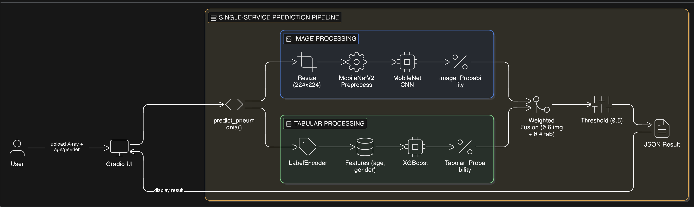

# 🩺 Pneumonia Detection (Ensemble CNN + XGBoost)

An ensemble-based pneumonia detection system combining deep learning (MobileNet CNN) and gradient boosting (XGBoost) for multimodal medical prediction.

The system integrates chest X-ray image features with structured clinical inputs to improve predictive performance.

---

## 🚀 Project Highlights

- Implemented stacked ML models using CNN (MobileNetV2) + XGBoost
- Designed training pipelines with cross-validation and evaluation benchmarking
- Achieved **0.72 AUC-ROC**
- Built interactive Gradio interface for real-time inference
- Sub-second prediction latency

---

## 🧠 Model Architecture

### 1️⃣ Image Branch (Deep Learning)
- MobileNetV2 backbone
- Transfer learning
- 224x224 X-ray preprocessing
- Early stopping training strategy

### 2️⃣ Tabular Branch (ML)
- XGBoost classifier
- Clinical features (age, gender)
- Label encoding
- Probability calibration

### 3️⃣ Ensemble Strategy
Final prediction:
0.6 x CNN Probability + 0.4 x XGBoost Probability

### Architecture Diagram

> Replace the filename below with your actual uploaded architecture image name.




🔁 Pipeline Flow

## 1️⃣ Image Processing Branch

- Resize to 224×224
- MobileNetV2 preprocessing
- MobileNet CNN inference
- Output: Image Probability (p_img)

## 2️⃣ Tabular Processing Branch

- Encode gender using LabelEncoder
- Construct features (age, gender)
- XGBoost inference
- Output: Tabular Probability (p_tab)	​

## 4️⃣ Decision Threshold

- If p_final ≥ 0.5 → PNEUMONIA
- Else → NO PNEUMONIA

## 5️⃣ Output

Returns structured JSON containing:
- Image model probability
- Tabular model probability
- Final probability
- Predicted label

---

## 📊 Performance

| Metric | Value |
|--------|-------|
| AUC-ROC | 0.72 |
| Inference Time | < 1 second |
| Deployment | Gradio Web UI |

---

## 🖥️ Demo

Run locally:

```bash
python gradio_app.py
```


## 🛠️ Tech Stack:

- Python
- TensorFlow / Keras
- XGBoost
- Scikit-learn
- Gradio
- Pandas,  NumPy

## ▶️ How to Run the Project

Follow the steps below to run the application locally.

### 1️⃣ Clone the Repository

```bash
git clone https://github.com/SanketJanger/Ensemble-Learning-for-Medical-Risk-Prediction.git
cd Ensemble-Learning-for-Medical-Risk-Prediction
```

## 2️⃣ Create and Activate a Virtual Environment
1. On Mac or Linux: 
```
python3 -m venv .venv
source .venv/bin/activate
```
2. If using Windows:
```
.venv\Scripts\activate
```

## 3️⃣ Install Dependencies
```
pip install --upgrade pip
pip install -r requirements.txt
```

## 4️⃣ Run the Gradio Application
```
python gradio_app.py
```

## 5️⃣ Open in Browser
After running the script, open the URL printed in your terminal
Typically : "http://127.0.0.1:7860"

## Author:
# SANKET JANGER
